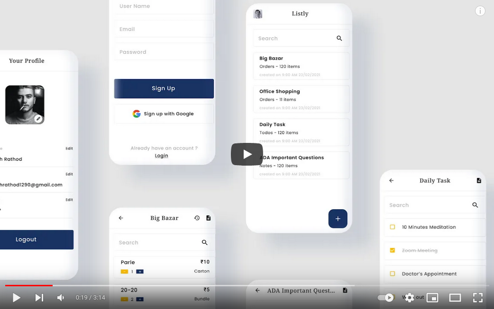
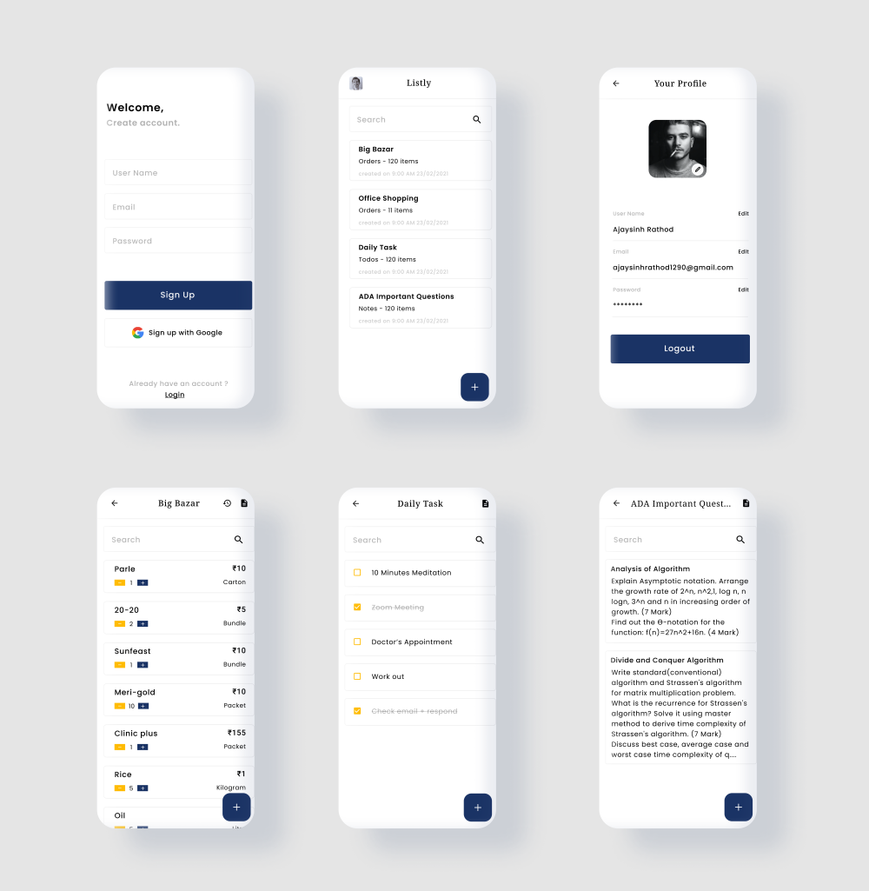

# Listly

Listly provides you with ability to save and share your personal Shopping lists, To-do list, Notes and Orders.

It is truly usable with great user experience. It is designed to help you keep track of your lists and let you view your list items in the order you want. Listly lets you organize your lists in a manner to help you get your shopping done quickly.

### Youtube

### Features

<ol>
    <li>Easy login & registration</li>   
    <li>Easily create lists with categories</li>  
    <li>No advertisements, ad-free</li>   
    <li>Every content nests into other contents and arrange the order to make lists by using navigation buttons easily.</li>   
    <li>Search text in contents and in lists</li>   
    <li>Send list to others easily via messaging sms, email and any social media.</li>   
    <li>Print out your list from the app easily</li>   
    <li>Create different shopping lists for each store</li>
    <li>View or edit any of your saved lists and items</li>
    <li>Prioritize your tasks with reordering items</li>
</ol>

### Use Checklist for different purposes

<ul>
    <li>To-do List</li>   
    <li>Orders</li>  
    <li>Wishlist</li>   
    <li>Inventory</li>   
    <li>Notes</li>   
    <li>Tasks</li>   
    <li>Shopping List</li>   
    <li>Grocery List</li>
    <li>And many more...</li>

</ul>

### Mockups

### [Download Apk](Listly.apk)
